# portfolio-zen

Personal portfolio — dark, typographic, with a live ASCII black hole on the home page.
Live at https://zenolitee.github.io/portfolio-zen/



## Run locally

ES modules need a server (not `file://`):

```sh
python -m http.server 8765
# open http://localhost:8765/
```

## Checks

```sh
npm test              # renderer, link checker and README-SVG tests (Node 22+, no dependencies)
npm run check-links   # every internal link resolves
```

## Add a project

1. Copy `_templates/project.html` to `projects/<slug>.html` and fill in the UPPERCASE placeholders.
2. Put images in `assets/projects/<slug>/` (cover is shown at 16:10).
3. Add a card to `projects/index.html`, then run `npm run check-links`.

Notes work the same way with `_templates/note.html` and `notes.html`.

## Black hole

- `js/blackhole-core.js` — pure renderer (no DOM), shared by the site and the README generator.
- `js/blackhole.js` — mounts it into the home page: sizing, 30 fps loop, pausing.
- `npm run readme-svg` — regenerates `assets/readme/blackhole.svg` for the GitHub profile.

Design notes: `docs/superpowers/specs/2026-09-30-portfolio-design.md`.
